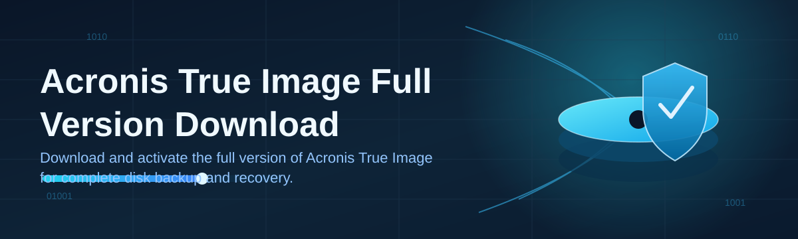

# Acronis-True-Image-Full-Version-Download-571 🛡️💽

  

*A disk-imaging companion built for people who never want to hear the words "unrecoverable data loss."*

  

---

## ⚡ Quick Start

> Three steps, no ceremony.

1. **Visit** the project landing page via the download button below.

2. **Download** the current build package for your Windows edition.

3. **Run** the launcher, point it at a source volume, and let the snapshot engine take over.

---

## 🧭 Overview

Acronis-True-Image-Full-Version-Download-571 is a documentation and distribution front-end for a Windows-based disk imaging and system recovery workflow inspired by the Acronis True Image lineage. The project exists because full-disk backup tooling has historically been split between bloated enterprise suites and fragile freeware scripts — this repository aims to sit in the middle: a straightforward, standalone package that a system administrator, a home-lab tinkerer, or a small IT shop can grab, run, and trust without wading through a maze of configuration wizards.

The core idea driving this project is **architectural honesty**: a backup tool should behave predictably under pressure — during a failing drive, a ransomware scare, or a botched OS upgrade — not just during a comfortable demo. Every design decision documented here, from the sector-level cloning approach to the incremental snapshot chain, is made with recovery-time and recovery-point objectives in mind, not just feature-list marketing.

This landing page is intended for IT professionals, backup-conscious power users, and anyone evaluating an Acronis True Image full version download for 2026 workloads. Whether you're imaging a single workstation or standardizing a fleet of endpoints, the material below explains not just *what* the tool does, but *why* it was built that way.

---

## 🏗️ Capabilities That Actually Matter

- **Sector-aware full disk imaging** — captures a volume at the block level rather than the file level, so boot records, partition tables, and hidden recovery sectors survive the round trip intact.

- **Incremental snapshot chaining** — after the first full image, subsequent runs store only changed blocks, which keeps storage costs sane on machines that get backed up daily.

- **Bootable recovery environment** — a pre-OS recovery layer lets you restore a system even when Windows itself refuses to boot, because the best backup tool is the one that still works on your worst day.

- **Universal restore logic** — decouples the image from the exact hardware it was taken on, so a restored system can boot on a different motherboard or drive controller without a blue-screen surprise.

- **Scheduled backup policies** — define recurring windows (daily, weekly, event-triggered) so protection isn't dependent on someone remembering to click a button.

- **Integrity verification pass** — every image can be checksum-validated post-creation, turning "I think the backup worked" into "I know the backup is restorable."

- **Compression tiering** — choose between speed-first and size-first compression profiles depending on whether your bottleneck is disk space or backup window duration.

- **Cloning for drive migrations** — move an entire OS installation from an aging HDD to a new SSD without a reinstall, useful for hardware refresh cycles.

> [!TIP]
> Run your first full image during a low-usage window. Sector-level reads on a busy disk take noticeably longer than on an idle one.

---

## 🚀 How To Get Started

1. Open the landing page using the download badge in this README.

2. Grab the build matching your Windows version (10 or 11, 64-bit).

3. Launch the installer/launcher — no separate runtime installation is required.

4. Select a source disk, choose a destination for the image, and start your first backup job.

> [!NOTE]
> First-run full imaging duration scales with disk size and data density, not just raw capacity. A mostly-empty 2TB drive images faster than a nearly-full 500GB one.

---

## 🖥️ System Requirements

| Component | Minimum | Recommended |
|---|---|---|
| **OS** | Windows 10 (64-bit) | Windows 11 (64-bit, latest patch) |
| **RAM** | 4 GB | 8 GB or higher |
| **Disk** | 1 GB free (application) + space equal to source data for images | SSD with headroom for incremental chains |

<strong>Why these numbers specifically?</strong>

 

The 4 GB RAM floor reflects what's needed to hold block-mapping metadata in memory during a full-disk read without excessive paging. Below that, imaging still works — it just leans harder on disk swap and slows down.

 

The disk space recommendation isn't arbitrary either: incremental chains grow over time, and running out of destination space mid-backup is one of the more avoidable failure modes in this category of software.

---

## ⚙️ How It Works — Under The Hood

The workflow is intentionally linear so that failure points are easy to isolate and diagnose:

1. **Discovery** — the tool enumerates connected volumes and their filesystem metadata.

2. **Snapshot lock** — a point-in-time state of the disk is frozen so live writes don't corrupt the image mid-capture.

3. **Block transfer** — sectors are streamed to the destination, compressed per the selected profile.

4. **Verification** — checksums confirm the written image matches the captured snapshot.

5. **Ready state** — the image is registered and available for future incremental runs or full restores.

> [!IMPORTANT]
> Never interrupt the snapshot-lock phase manually (e.g., forced shutdown). Doing so can leave a partial image that fails verification — always let a running job cancel gracefully if you must stop it.

---

## 🧩 Troubleshooting

**Q: My backup job says "disk in use" and won't start.**
A: Close applications with open handles on the target volume, or use the snapshot-lock mode which works around most live-file conflicts.

**Q: Restore completed but the system won't boot.**
A: Confirm you used universal restore mode when migrating to different hardware — a same-hardware restore image applied to new hardware without it commonly fails at boot.

**Q: Incremental backups are growing larger than expected.**
A: This usually means a high rate of file churn (temp files, logs, VM disks). Consider consolidating the chain into a new full image periodically.

**Q: Verification pass fails intermittently.**
A: Check destination drive health first — flaky storage media is the most common cause of checksum mismatches, not the imaging engine itself.

**Q: The bootable recovery environment doesn't detect my network drive.**
A: Recovery environments ship a limited driver set; mapping a network path may require the vendor-specific network driver bundle for that hardware.

> [!WARNING]
> Always test a restore on non-critical hardware at least once before relying on a backup chain for production recovery. An untested backup is a hypothesis, not a guarantee.

---

## 🎨 UI / UX Details

| Element | Detail |
|---|---|
| **Themes** | Light and dark, following system preference by default |
| **Shortcut: New Backup Job** | `Ctrl+N` |
| **Shortcut: Open Recovery Console** | `Ctrl+R` |
| **Shortcut: Pause Active Job** | `Ctrl+P` |
| **Settings location** | Local config file, no cloud sync required |

> [!NOTE]
> All settings are stored locally by default — nothing is transmitted off-device unless you explicitly configure a network destination for backup storage.

---

## 🤝 Contributing & Community

Contributions, issue reports, and discussion threads are welcome. If you're proposing a change to documentation or workflow diagrams, please open an issue first so the direction can be discussed before a pull request is drafted.

- Bug reports → open an Issue with reproduction steps

- Feature ideas → open a Discussion thread

- Documentation fixes → PRs welcome directly

  

---

## 📄 License

Released under the [MIT License](LICENSE), 2026.

---

## ⚠️ Disclaimer

> This repository is provided for informational and educational purposes related to disk imaging and system recovery workflows. Always back up critical data through multiple independent methods, verify restores before relying on them, and use third-party software in accordance with its own licensing terms.

---

